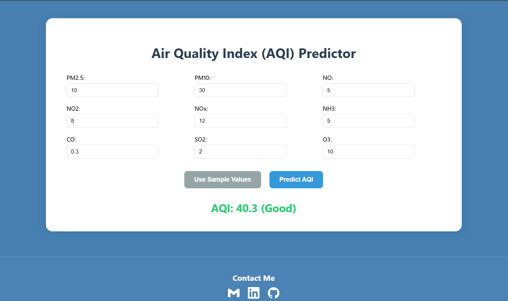

# 🌐 AQI Predictor - Machine Learning Web App

This project is a web application built using **Flask** and **Random Forest Regressor** that predicts the **Air Quality Index (AQI)** based on various air pollutant parameters.

🚀 Deployed Live: [Visit App](https://aqi-predictor-pqmh.onrender.com)
📊 Dataset Source: [https://www.kaggle.com/datasets/rohanrao/air-quality-data-in-india]
---

## 🧠 Features

- Predict AQI using PM2.5, PM10, NO, NO2, NH3, CO, SO2, O3
- Built using `scikit-learn` and `Flask`
- Simple and responsive UI using HTML, CSS, JavaScript
- Trained model saved and loaded using `joblib`
- Deployment on Render
---

## 🛠️ Tech Stack

| Category       | Tech Used            |
|----------------|----------------------|
| ML Model       | RandomForestRegressor |
| Backend        | Flask (Python)       |
| Frontend       | HTML, CSS, JS        |
| Deployment     | Render               |
| Version Control| Git & GitHub         |
---

## 🧪 Model Overview
- Algorithm Used: RandomForestRegressor
- Best Parameters (via GridSearchCV):
- n_estimators = 50
- max_depth = 10
- Target Variable: AQI
- Features: PM2.5, PM10, NO, NO2, NOx, NH3, CO, SO2, O3
---

## 📸 Screenshots

---
